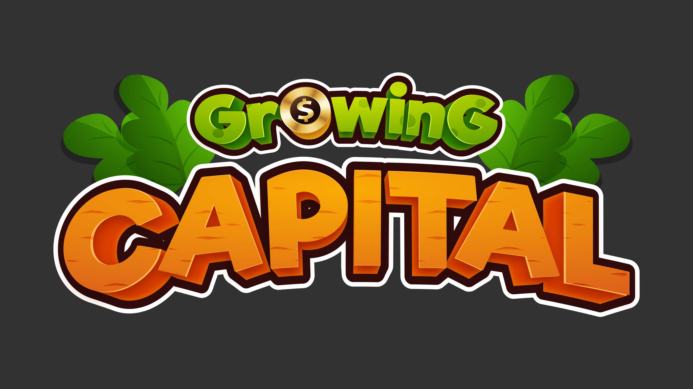

# Growing Capital

Growing Capital is my submission for my computer science A level coursework at Dulwich College. 
This was my first time making a C++ project of this scale, and at first it felt like feeling around in the dark. 

### Tech Stack

I experimented with everything I could find because I was convinced that there would be a perfect fit for my project. I have since started adjusting my expectations and focus more on finding the actual solution to my domain. Here is a list of what I used to develop this game.

- Programming Languages: **C++**, **BASH** 
- Software: **Sublime Text 3**, **Aseprite**
- Libraries: **raylib**
- Debugging: **GDB**, **Valgrind**
- Build Systems: **CMake**, **Premake**

There was a lot of throwing stuff at the wall, and seeing what sticked. I won't go into too much detail on why I chose each tool, as I covered it extensively in my coursework write-up. If interested, it is availible for download here. 

### The Game

I wanted to make a game about farming, but more about resource management than waiting for plants to grow. Every so often, you must pay "rent" which scales with the amount of time you have managed the farm. The goal is to last long enough and make enough money to buy the farm outright.

The game features a full farming simulator, changing seasons, a simulated economy, etc... You can find much more information in my coursework write-up, if you are interested. 

I will not distribute a build of the game, but am happy to provide one if you contact me and have an appropriate reason. 

### Experience

I can't understate how much this project helped build my confidence creating software. Looking under the hood, failing again and again to segfaults, linker errors, code problems like bad OOP implementation and crude architectural choices. I gained a lot of discipline and caution when it came to taking shortcuts. More imporantly, it demystified bugs and errors for me.

Today, I don't get discouraged when I encounter a bug nor do I hestiate to use open source libraries/resources. I try to make architectural choices that fit my project and scope. I've learnt so much since then, but this project was an entrypoint for me into the world beyond just DSA and code. 

The graphics were slapped together using public domain resources and some art provided by friends. To this day I find art assets to be the main barrier to me making more games. 