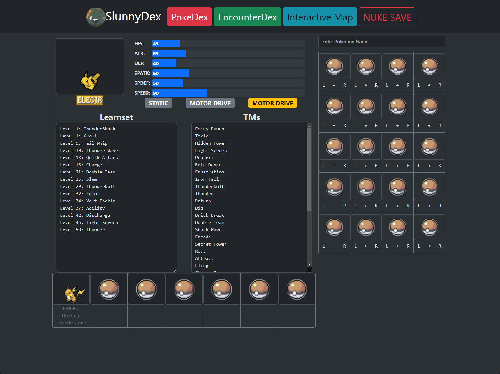
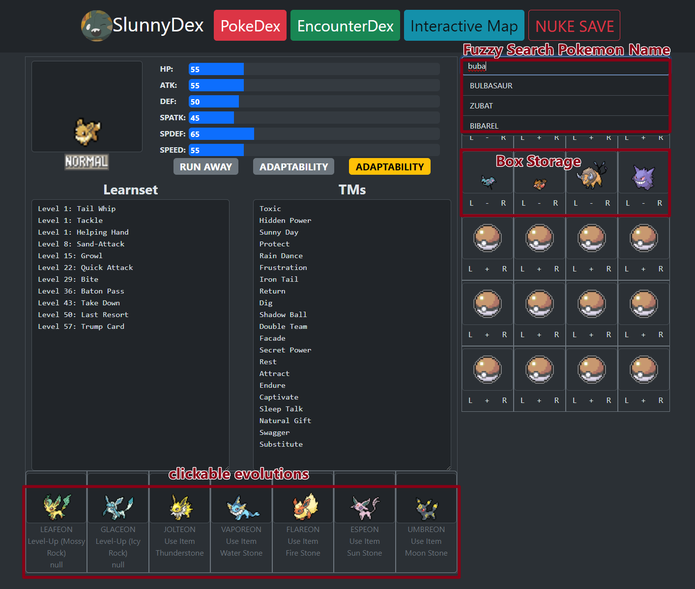
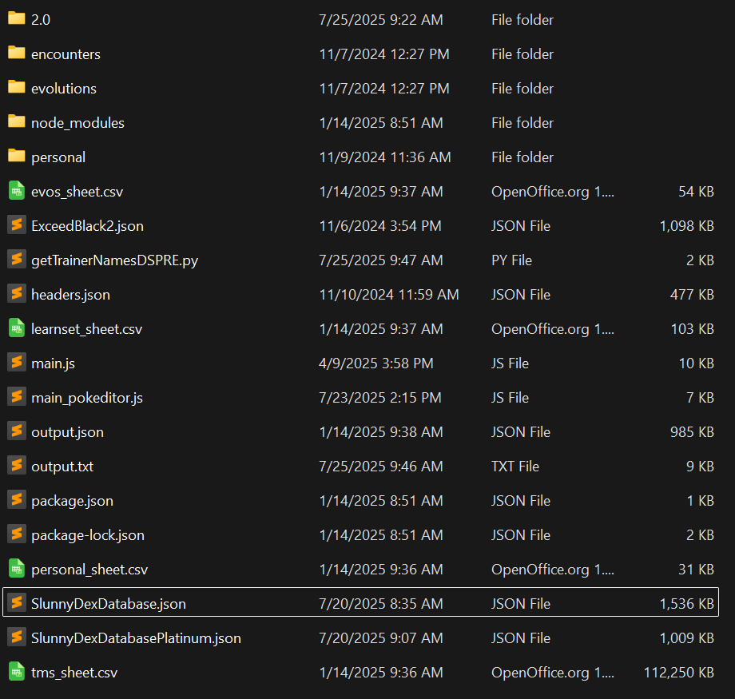

# SlunnyDex

This is a custom pokemon data viewer affectionately named "SlunnyDex"
I created it because while playing pokemon Nuzlockes with custom roms, it was difficult to keep track of the changes the romhacker made.
This program included a CLI tool to extract data from modified NDS roms, to then import into the frontend. This ensures correct information for the ROM we are playing, and a clean interface. 

### Tech Stack

In this project I used:
- Svelte
- Bootstrap, leafletjs
- Vue 
- Electron, Nodejs

This was my first experience using both leaflet and electron. And for the database I just went with a simple JSON format, since there is not a huge amount of data each game there is no real performance loss. Additionally, since I use a generator to extract information from the rom, I can easily change the schema of the database and generate the new one. 

### The Features

As seen in the screenshot, this program provides the Base Stats of the pokemon, the possible Abilities, and the moveset as primary information. Below that shows the possible evolutions for the pokemon as well as the method. This was a particularly important feature that was neglected in early versions of the program. 

Both the evolutions and the "Box" storage on the right hand side can be interacted with to display a certain pokemon with ease. The saved pokemon on the right persist between sessions, and can be managed with the somewhat indiscreet button in the nav bar. 

The **Encounter Dex** and **Interactive Map** work in conjunction. For those unfamiliar with classic pokemon games, running into tall grass will trigger an encounter with a random wild pokemon. This wild pokemon is selected from a pool of at most 12 different pokemon, and changes depends on the location of the player. 
The encounter dex displays the information for a given location based on its name. Showing the species, odds, and encounter method. 
The map is exactly what it sounds like, a rough approximation of the in game map with links to the encounter dex located in each relevant location. 

Across the entire program fuzzysearch and a searchbar is used as the main way to access the data. This was done using the javascript backend.

I will not distribute this program for various reasons, namely that there are Pokemon sprites. 

### Experience

I originally did not plan for this program to be so featureful. The first version of this software simply outputs a spreadsheet containing the information.

This was all I had planned. To sort the information from files: headers, personal, tms, evos, learnset, and the directories: encounters, personal, evolutions.

I thought I should build a simple interface to make lookup easier than ctrl-F in a big JSON file. 

Then bit by bit I kept coming up with more ideas... What if you could search for the pokemon? What if it also showed encounters? Oh but it's annoying to type in the name, what if there was an interactive map? What if I could save some pokemon to quickly reference later... etc. 

I stopped myself when I had the idea to index and detail every trainer in the game and their teams. I had already implemented so much more than I had planned for and the effort to reward ratio was taking a nosedive. 

It was with this project that I discovered I truly have an issue with scope creep. Simply because there was no deadline and no urgency, I started adding features and polish that the users didn't really care for. Going forward I have been carefully considering the requriements for each project and focusing on the features that are important. 

I had wanted to make this project using a completely new tech stack than I was used to. I learnt a lot about front-end structure, navigated ESM and CJS, and much more. However, for this kind of application in the future, I'll stick with ImGui & C++. I realised I love to build features, not styling pages and centering divs.